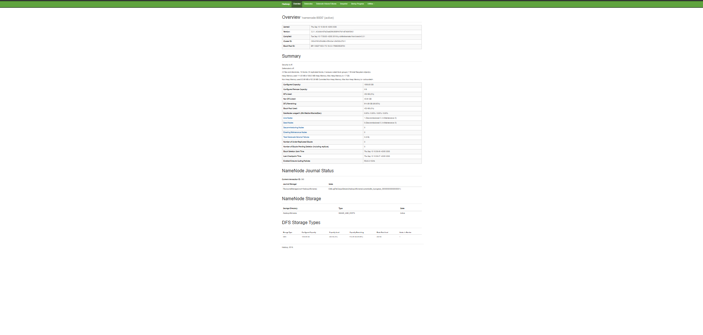
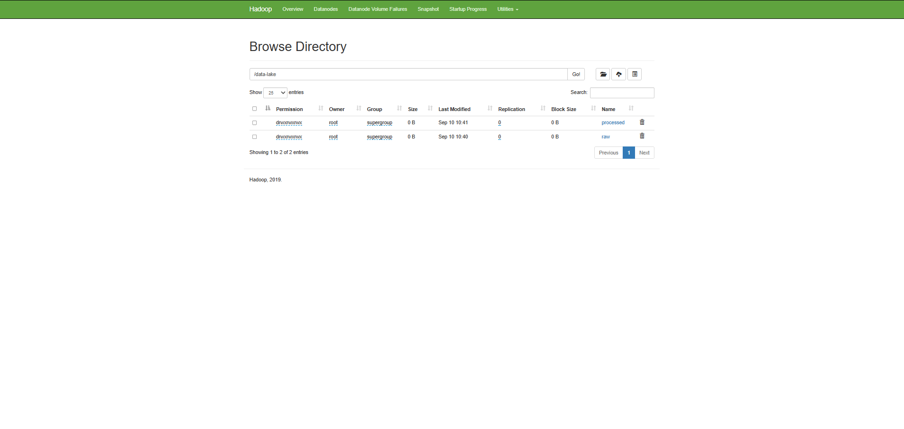
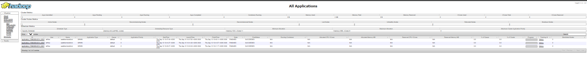
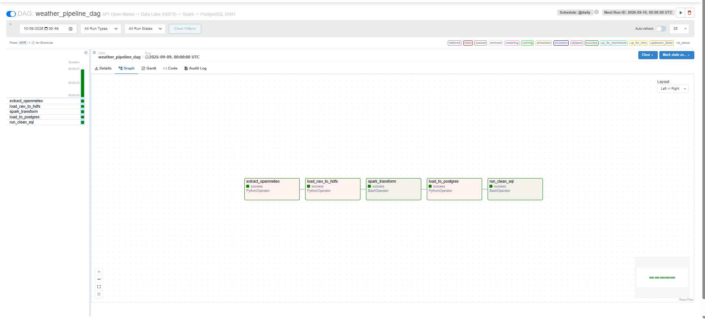
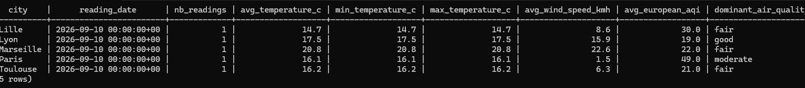

# Weather Data Pipeline — Hadoop / Spark / Airflow / PostgreSQL

## 1. Description du cas d'usage

Pipeline de données complet qui collecte, quotidiennement, la météo et la
qualité de l'air de plusieurs villes françaises via l'API publique
**Open-Meteo**, stocke les données brutes dans un **Data Lake HDFS**, les
nettoie/transforme avec **Apache Spark** (soumis sur **YARN**), puis les
charge dans un **Data Warehouse PostgreSQL** exposé via des vues SQL
propres et analysables. L'ensemble est orchestré par **Apache Airflow**,
conteneurisé avec **Docker Compose**, testé et validé via **GitHub
Actions (CI/CD)**, et déployable sur **AWS EC2**.

**Données en continu** : Open-Meteo renvoie les relevés météo/qualité de
l'air **en temps réel** (pas un jeu de données statique). Le DAG Airflow
est planifié `@daily` : à chaque exécution, il interroge l'API à nouveau,
dépose une nouvelle partition (`dt=YYYY-MM-DD`) dans le Data Lake, et
accumule l'historique dans le Data Warehouse au lieu de l'écraser — le
pipeline est donc pensé pour tourner en continu, jour après jour.

## 2. Architecture technique

```
Open-Meteo API (météo + qualité de l'air)
        │  ingestion/extract_openmeteo.py
        ▼
JSON brut (local, horodaté)
        │  upload WebHDFS  (etl/hdfs_utils.py)
        ▼
┌─────────────────────────────────────────────────────────┐
│ HDFS  /data-lake/raw/weather/dt=YYYY-MM-DD/              │  ← Data Lake
└─────────────────────────────────────────────────────────┘
        │  spark-submit --master yarn --deploy-mode client
        │  spark_jobs/transform_weather.py
        ▼
┌─────────────────────────────────────────────────────────┐
│ HDFS  /data-lake/processed/weather/dt=YYYY-MM-DD/ (Parquet)│
└─────────────────────────────────────────────────────────┘
        │  etl/load_to_postgres.py
        ▼
PostgreSQL (postgres-dwh)
  staging_weather  →  vues clean_weather / daily_weather_summary   ← Data Warehouse
```

Orchestration Airflow (`airflow/dags/weather_pipeline_dag.py`, DAG
`weather_pipeline_dag`, planifié `@daily`) :

`extract_openmeteo` → `load_raw_to_hdfs` → `spark_transform` →
`load_to_postgres` → `run_clean_sql`

### Composants Docker (réseau `hadoop-net`)

| Service              | Image                                             | Rôle                          | Port hôte |
|-----------------------|---------------------------------------------------|-------------------------------|-----------|
| `namenode`            | `bde2020/hadoop-namenode:2.0.0-hadoop3.2.1-java8`  | HDFS NameNode                 | 9870, 9000 |
| `datanode`             | `bde2020/hadoop-datanode:2.0.0-hadoop3.2.1-java8`  | HDFS DataNode                 | —         |
| `resourcemanager`      | `bde2020/hadoop-resourcemanager:...`               | YARN ResourceManager          | 8088      |
| `nodemanager`          | `bde2020/hadoop-nodemanager:...`                   | YARN NodeManager              | 8042      |
| `historyserver`        | `bde2020/hadoop-historyserver:...`                 | YARN Timeline/History         | 8188      |
| `postgres-dwh`         | `postgres:16`                                      | Data Warehouse                | 5433      |
| `postgres-airflow`     | `postgres:16`                                      | Métadonnées Airflow           | —         |
| `airflow-webserver`    | build local (`airflow/Dockerfile`)                 | UI Airflow                    | 8080      |
| `airflow-scheduler`    | build local (`airflow/Dockerfile`)                 | Scheduler + driver Spark      | —         |

L'image `airflow-spark` (custom) embarque Java 17, Spark 3.5.9 (build
Hadoop 3) et les clients Python HDFS/PostgreSQL. Le job Spark est soumis
en `--deploy-mode client` : le driver tourne dans ce conteneur, les
exécuteurs sont lancés par YARN sur le `nodemanager`. La transformation
n'utilisant aucune UDF Python, aucun interpréteur Python n'est requis côté
exécuteur — ce qui évite d'installer Spark/Python dans les images Hadoop
du cluster.

## 3. Prérequis

- Docker Desktop (avec WSL2 sous Windows) — Docker Engine ≥ 24, Compose v2
- **16 Go de RAM minimum** alloués à Docker (le stack HDFS+YARN+Spark+Airflow+Postgres est gourmand)
- Ports libres sur l'hôte : `8080`, `8088`, `8042`, `8188`, `9870`, `9000`, `5433`
- Un compte GitLab (dépôt) et, pour le déploiement, un compte AWS

Aucune installation locale de Java/Hadoop/Spark n'est nécessaire : tout
tourne dans les conteneurs.

## 4. Installation et déploiement (local)

```bash
git clone <URL_DU_DEPOT_GITLAB>
cd hadoop-pipeline
cp .env.example .env
# Générer une vraie Fernet key pour Airflow (optionnel mais recommandé) :
python3 -c "from cryptography.fernet import Fernet; print(Fernet.generate_key().decode())"
# -> coller le resultat dans AIRFLOW__CORE__FERNET_KEY du .env

docker compose up -d --build
```

Attendre 1 à 2 minutes que tous les services soient prêts, puis initialiser
l'arborescence du Data Lake :

```bash
./scripts/init_hdfs_dirs.sh
```

Vérifier que tout tourne :

```bash
docker compose ps
```

Pour un déploiement sur AWS EC2, voir [`deploy/aws/DEPLOY.md`](deploy/aws/DEPLOY.md).

## 5. Guide d'exécution

### Déclencher le pipeline

Via l'UI Airflow (`http://localhost:8080`, identifiants dans `.env` —
`AIRFLOW_ADMIN_USER` / `AIRFLOW_ADMIN_PASSWORD`) : activer puis déclencher
(bouton ▶) le DAG `weather_pipeline_dag`.

Ou en ligne de commande :

```bash
docker exec airflow-webserver airflow dags trigger weather_pipeline_dag
```

Suivre l'exécution :

```bash
docker exec airflow-webserver airflow dags list-runs -d weather_pipeline_dag
```

### Vérifier chaque étape

- **Data Lake (HDFS)** : `http://localhost:9870` → Utilities > Browse the
  file system > `/data-lake/raw/weather` et `/data-lake/processed/weather`
  ou en CLI :
  ```bash
  docker exec namenode hdfs dfs -ls -R /data-lake
  ```
- **Job Spark sur YARN** : `http://localhost:8088` → l'application Spark
  doit apparaître avec l'état `FINISHED` / `SUCCEEDED`
- **Data Warehouse (PostgreSQL)** :
  ```bash
  docker exec -it postgres-dwh psql -U <DWH_POSTGRES_USER> -d <DWH_POSTGRES_DB> \
    -c "SELECT * FROM daily_weather_summary;"
  ```

### Tests automatisés

```bash
pip install -r requirements-dev.txt
pytest tests/ -v
```

## 6. CI/CD

Le dépôt étant hébergé sur GitHub, le CI/CD actif est **GitHub Actions**
(`.github/workflows/`) :

- `ci.yml` (automatique, à chaque push/PR sur `main`) :
  1. **lint** — `ruff` sur le code Python (ingestion, spark_jobs, etl, dags)
  2. **test** — `pytest` (tests unitaires extraction + transformation Spark)
  3. **build** — build de l'image Docker `airflow-spark` (validation du Dockerfile)
- `deploy.yml` (déclenchement **manuel** uniquement, onglet Actions >
  Run workflow) : SSH vers l'instance EC2 et `docker compose up -d --build`
  — nécessite les secrets de repo `EC2_HOST` et `EC2_SSH_KEY`
  (Settings > Secrets and variables > Actions)

Un pipeline GitLab CI équivalent (`.gitlab-ci.yml`) est conservé dans le
dépôt si un miroir GitLab est nécessaire, mais n'est pas exécuté sur GitHub.

## 7. Preuves de fonctionnement

Pipeline exécuté et vérifié de bout en bout (voir [`screenshots/`](screenshots/)) :

**HDFS NameNode**



**YARN — job Spark réussi**


**Airflow — DAG complet au vert**


**PostgreSQL — résultat de la vue propre**


## 8. Arborescence du projet

```
hadoop-pipeline/
├── docker-compose.yml       # tous les services (Hadoop, Spark client, Airflow, Postgres)
├── hadoop.env                # config du cluster HDFS/YARN (images bde2020)
├── airflow/
│   ├── Dockerfile            # image Airflow + Java + Spark + libs
│   ├── conf/                 # core-site.xml / hdfs-site.xml / yarn-site.xml (client)
│   └── dags/weather_pipeline_dag.py
├── ingestion/extract_openmeteo.py
├── spark_jobs/transform_weather.py
├── etl/{hdfs_utils.py, load_to_postgres.py}
├── sql/{01_create_schema.sql, 02_clean_views.sql}
├── scripts/init_hdfs_dirs.sh
├── tests/
├── deploy/aws/{user-data.sh, DEPLOY.md}
└── .gitlab-ci.yml
```
